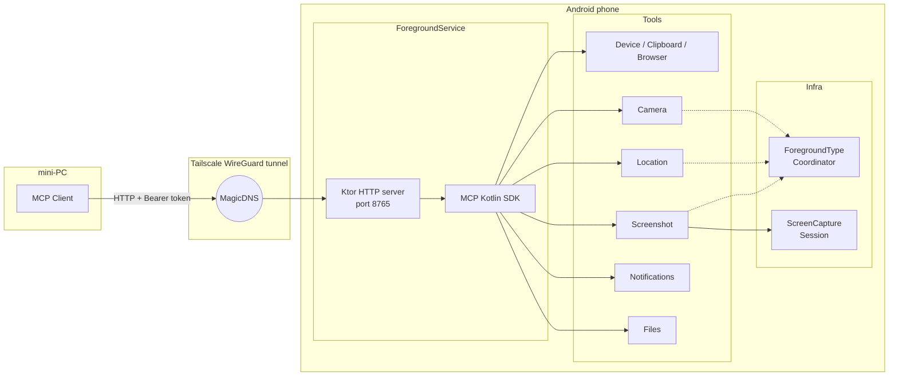

# MCPDroid

An Android app that exposes phone capabilities as MCP tools over HTTP. Any MCP client (Hermes Agent, Claude Desktop, MCP Inspector, etc.) can connect and use them.

## Architecture



The phone runs a foreground service hosting a Ktor HTTP server with the official MCP Kotlin SDK. Clients connect over Tailscale (WireGuard) or the local network. Every request requires a bearer token.

The service starts with `specialUse` FGS type and dynamically elevates (via `ForegroundTypeCoordinator`) to `camera`, `location`, or `mediaProjection` only while the corresponding tool is active.

## Requirements

- Android 10+ (API 29). Android 14+ (API 34) is recommended for full foreground service type support.
- [Tailscale](https://tailscale.com) installed on both the phone and the client machine, logged into the same account. Free for personal use (up to 100 devices).
- JDK 17+ and Android SDK 36 on the build machine (Android Studio Quail 1 / 2026.1.1 or later, or the command line).

## Setup

### 1. Install Tailscale

Install Tailscale on both devices and log in with the same account. Both will get a stable `100.x.y.z` IP and a MagicDNS hostname (e.g. `xiaomi-13t-pro`). MagicDNS is enabled by default. Use the hostname rather than the IP in your MCP client config.

### 2. Build and install the APK

From Android Studio: open the project, let it sync, then Run > app on your phone.

From the command line:

```bash
./gradlew assembleDebug
adb install app/build/outputs/apk/debug/app-debug.apk
```

### 3. Start the server

Open the app on the phone and tap **Start Server**. The app displays:

- All reachable network addresses (Tailscale addresses are labeled)
- The bearer token (tap the copy icon)
- A ready-to-paste MCP client config snippet (Hermes Agent format)

**Battery optimization:** Android may kill the server in Doze mode. If you see the warning banner, tap it to disable battery optimization for MCPDroid.

**Auto-start on boot:** Enable the toggle in the Settings card if you want the server to start automatically when the phone reboots.

### 4. Configure the MCP client

Copy the config snippet from the app (or fill in manually) and add it to your MCP client's config. For Hermes Agent, that's `~/.hermes/config.yaml` on the mini PC. Use the phone's Tailscale MagicDNS hostname instead of the raw IP:

```yaml
mcp_servers:
  phone:
    url: 'http://<phone-tailscale-hostname>:8765/mcp'
    headers:
      Authorization: 'Bearer <token-from-app>'
    timeout: 180
    connect_timeout: 60
```

The hostname is the device name shown in the Tailscale admin console (e.g. `xiaomi-13t-pro`). You can also use the full MagicDNS FQDN (e.g. `xiaomi-13t-pro.tail49xxx.ts.net`). Both work as long as MagicDNS is enabled in your tailnet (it is by default). The raw Tailscale IP (`100.x.y.z`) also works but may be flagged as suspicious by some clients.

Verify DNS resolution from the mini PC: `ping <phone-tailscale-hostname>`.

For Hermes Agent: in a running chat, run `/reload-mcp` and ask "What MCP tools do you have?" -- the phone tools should appear.

### 5. Verify the connection

The recommended way to test is the **MCP Inspector**, which handles the full protocol handshake automatically:

```bash
npx -y @modelcontextprotocol/inspector
# Connect to: http://<phone-tailscale-hostname>:8765/mcp
# Add header: Authorization: Bearer <token>
```

**Quick auth check with curl.** This verifies network connectivity and that the bearer token is accepted. Note: the MCP Streamable HTTP transport requires the `Accept` header shown below, and follows a stateful protocol (initialize before any other method).

```bash
# Step 1: initialize the session (required before any other MCP call)
curl -s -X POST http://<phone-tailscale-hostname>:8765/mcp \
  -H "Authorization: Bearer <token>" \
  -H "Content-Type: application/json" \
  -H "Accept: application/json, text/event-stream" \
  -d '{"jsonrpc":"2.0","id":1,"method":"initialize","params":{"protocolVersion":"2025-03-26","capabilities":{},"clientInfo":{"name":"curl-test","version":"1.0"}}}'
```

A successful response returns `{"result":{"protocolVersion":...,"serverInfo":...}}` and an `mcp-session-id` header. A request without the bearer token returns HTTP 401. Without the `Accept` header you get a 406 "Not Acceptable" error.

For full tool listing, use the MCP Inspector or your MCP client directly -- they maintain the session properly across the initialize/tools-list sequence.

### 6. Grant permissions (per tool, as needed)

Permissions are requested at runtime the first time a tool needs them. Grant them from the phone when prompted, or pre-grant them in Android Settings > Apps > MCPDroid > Permissions.

| Permission          | Tools that need it   | How to grant                                                                         |
| ------------------- | -------------------- | ------------------------------------------------------------------------------------ |
| Camera              | `capture_photo`      | Runtime prompt or app settings                                                       |
| Location            | `get_location`       | Runtime prompt or app settings                                                       |
| Notification access | `list_notifications` | Android Settings > Apps > Special app access > Notification access > enable MCPDroid |

### 7. Enable screenshot capture (optional)

`capture_screenshot` requires a one-time consent per session:

1. Open the app and tap **Enable Screenshot**. Android shows a system consent dialog.
2. The service starts a persistent screen capture session. `capture_screenshot` can then be called repeatedly without re-prompting.
3. The session stays active until you tap **Stop Screenshot Session** in the app, or the system revokes it (e.g. screen lock, another app starting a projection).
4. After revocation, the tool returns a clear error asking you to re-enable in the app.

## Tool catalog

| Tool                 | Description                                                                            |
| -------------------- | -------------------------------------------------------------------------------------- |
| `ping`               | Health check, returns ok and a Unix timestamp                                          |
| `get_device_status`  | Battery level, charging state, network type, Wi-Fi, Bluetooth, device model            |
| `read_clipboard`     | Read current clipboard text (works best when the app is in the foreground)             |
| `write_clipboard`    | Write text to the clipboard                                                            |
| `open_url`           | Open a URL in the default browser (http/https only)                                    |
| `get_location`       | Current GPS position (lat, lon, accuracy, timestamp)                                   |
| `list_files`         | List recent files from MediaStore (Downloads, Images, Documents)                       |
| `read_file`          | Read a file by content URI (text or base64, max 5 MB)                                  |
| `share_file`         | Share a file via the Android share sheet                                               |
| `capture_photo`      | Take a photo with the back or front camera, returned as base64 JPEG                    |
| `capture_screenshot` | Capture the screen, returned as base64 JPEG (requires one-time consent, see above)     |
| `list_notifications` | Recent active notifications, optionally filtered by app (requires notification access) |

## Security model

- **Transport:** all traffic goes over the Tailscale WireGuard tunnel. The server binds to `0.0.0.0` but is only reachable from the tailnet -- it is not exposed to the public internet. Use the MagicDNS hostname in the MCP client config so the connection looks like a named host rather than a raw IP.
- **Auth:** every `/mcp` request requires `Authorization: Bearer <token>`. The token is a 64-character random hex string generated on first launch.
- **Storage:** the token is stored in app-private `SharedPreferences`. Android's file-based encryption (mandatory on API 29+) protects it at rest. For a distributed app you would add Android Keystore wrapping.
- **DNS-rebinding protection:** disabled in the Ktor server config because MCP clients connect from a non-localhost tailnet address. The tailnet boundary + bearer token replace it.

## Foreground service types

The service starts as `specialUse` and dynamically elevates to additional types only while specific tools are running:

- `capture_photo` elevates to `camera` for the duration of the capture, then releases.
- `get_location` elevates to `location` for the duration of the fix, then releases.
- `capture_screenshot` holds `mediaProjection` for the entire session (the VirtualDisplay must stay alive to allow repeated captures from a single consent token).

This keeps the service at the minimal privilege level (`specialUse`) when idle.
